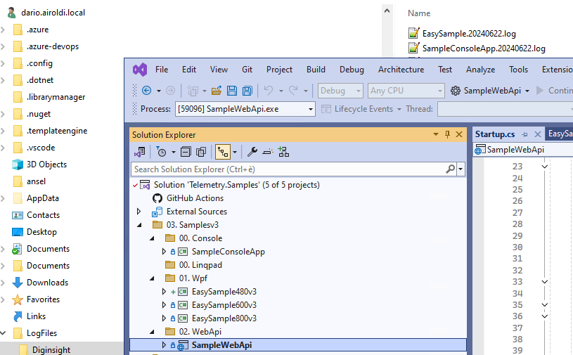

# telemetry_samples

## INTRODUCTION 

The `telemetry_samples` repository provides examples of using __diginsight telemetry__ for various __.NET versions__ and __application types__.  

It includes __samples for older .NET frameworks__ like __4.8 up to the newer .NET 8__, and for different application types such as __web apps__, __web APIs__, __WPF client apps__, and __console apps__.

The repository is designed to __help developers understand__ how to integrate diginsight telemetry into their applications by providing practical, hands-on examples.  
By exploring the samples, __developers can learn how to implement automatic observability__ provided by __diginsight__ and utilize the full application flow for local text-based streams and remote analysis tools like Azure Monitor and Prometheus/Grafana.

For overview and details of __diginsight telemetry__ and __application observability concepts__ please refer to
[diginsight telemetry](https://github.com/diginsight/telemetry) repository and documentation.  

## STEPS to build and use the telemetry samples

### STEP 01. Open and build the solution Telemetry.Samples

### STEP 02. run the sample you wish to analyze
set the proper startup project 

### STEP 02. open the file log 
Look at the application flow on the console log, the file log or other tool according to the sample description.
File logs can normally be obtained under the __%UserProfile%/LogFiles/Diginsight__ folder, as shown below:

## TELEMETRY SAMPLES REFERENCE

### SampleConsoleApp
Implements diginsight telemetry integrated into an __example console application__.

- diginsight flow is enabled at the console output

- diginsight flow is also enabled for the file log

file log can be obtained under the __%UserProfile%/LogFiles/Diginsight__ folder

### EasySample480.. 8**
Implements diginsight telemetry integrated into an __example client application__ with .Net Framework versions from old .net framework 4.8 to latest .net framework version.

diginsight flow is enabled for the file log 

file log can be obtained under the __%UserProfile%/LogFiles/Diginsight__ folder

### SampleWebApi
Implements diginsight telemetry integrated into an __example Web Api__.

# Contribute
Contribute to the repository with your pull requests. 

Thanks `Filippo`, `Dario`, `Alessandro`, `Raffaele`, `Anusuya` and `Sandeep` for your contributions to the samples!

- [telemetry](https://github.com/diginsight/telemetry)
- [telemetry_samples](https://github.com/diginsight/telemetry_samples)

# License
See the [LICENSE](<LICENSE>) file for license rights and limitations (MIT).

